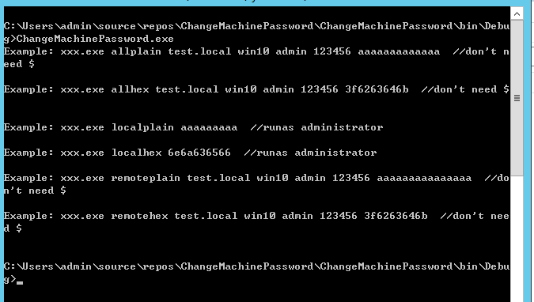
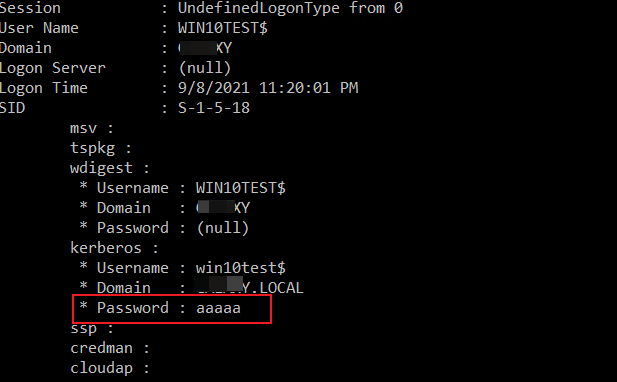
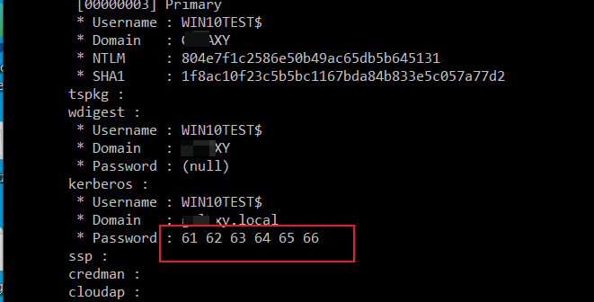

主要用于修改本地或者域控中计算机账号的密码，支持明文密码或者hex（有些字符不可打印只能用hex表示）

支持本地远程同时修改、只修改本地、只修改远程的密码。（r如果只修改本地或者远程，会导致脱域）

修改完后可使用mimikatz查看效果：

`privilege::debug token::elevate lsadump::secrets`  or

`privilege::debug token::elevate sekurlsa::logonpasswords`

默认情况下计算机账号是120字符，240字节，但是这个小程序可以随意修改，部分效果如下：

